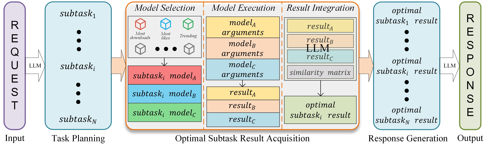

# CompeGPT

[](https://arxiv.org/abs/2308.16474)

## Introduction

Multi-modal large language models (MLLMs) have gained significant attention as powerful tools for tackling complex tasks that involve both text and other modalities. In traditional MLLM workflows, complex tasks are decomposed into subtasks, and specific pre-trained models are heuristically selected to complete each subtask. However, this static binding of models to subtasks can lead to suboptimal results. This project introduces **CompeGPT**, a dynamic orchestration approach that allows different models to compete for the same subtask, resulting in an optimized overall performance.

## Motivation

The motivation behind CompeGPT stems from the recognition that heuristically binding a single model to a subtask may not always yield the most satisfying result. By allowing multiple pre-trained models to compete for the same subtask and dynamically selecting the best result, CompeGPT aims to maximize the potential for achieving optimal results in multi-modal tasks.

## Methodology

### Task Planning

CompeGPT starts by leveraging a large language model (LLM) to analyze user input requests and decompose them into a set of structured subtasks. This involves identifying subtask requirements, extracting relevant data and contextual information, and determining dependencies and execution order.



### Optimal Subtask Result Acquisition

1. **Model Selection:** Models are selected based on descriptions obtained from the Hugging Face machine learning community. Multiple models are chosen for each subtask according to various evaluation metrics such as "Most Downloads," "Most Likes," and "Trending."

2. **Model Execution:** Selected pre-trained models for the same subtask are concurrently executed in parallel. The system inputs parameters and data into these models, obtaining multiple results.

3. **Result Integration:** A semantic cosine similarity matrix is employed to analyze the results and determine the optimal result for each subtask. The large language model (LLM) integrates these optimal results to provide the final response.

### Response Generation

The LLM amalgamates the optimal results of all subtasks to generate a user-friendly response. The response includes a concise summary of planning tasks and optimal results for each subtask.

## Experimental Results

To further demonstrate the model's generalization ability, we conducted experiments on additional multi-modal large model benchmarks, including MME and MM-Vet.


To demonstrate the model's validity and generalizability, we conducted experiments using additional pre-trained MLLMs across a broader range of multi-modal tasks.


The effectiveness of the proposed result integration method has been validated.


## How to start

##### System Requirements

We recommend the following configuration:

+ Ubuntu 16.04 LTS
+ VRAM >= 24GB
+ RAM > 12GB (minimum), 16GB (standard), 80GB (full)
+ Disk > 284GB

First, you need to input your Hugging Face API key and OpenAI API key in `server/configs/config.default.yaml`.

##### For the Server:

```bash
# Set up the environment
cd server
conda create -n jarvis python=3.8
conda activate jarvis
conda install pytorch torchvision torchaudio pytorch-cuda=11.7 -c pytorch -c nvidia
pip install -r requirements.txt

# Download models. Make sure to install `git-lfs`.
cd models
bash download.sh # Required when `inference_mode` is set to `local` or `hybrid`.

# Run the server
cd ..
python models_server.py --config configs/config.default.yaml # Required when `inference_mode` is set to `local` or `hybrid`
python awesome_chat.py --config configs/config.default.yaml --mode server # For text-davinci-003
```

Now, you can access the service through the Web API.

+ `/hugginggpt` --method `POST` for accessing the complete service.
+ `/tasks` --method `POST` for accessing intermediate results in the first phase.
+ `/results` --method `POST` for accessing intermediate results from the first to the third phase.

For example:

```bash
# Request
curl --location 'http://localhost:8004/tasks' \
--header 'Content-Type: application/json' \
--data '{
    "messages": [
        {
            "role": "user",
            "content": "Generate a beautiful image"
        }
    ]
}'
```

##### For the Web:

We provide a user-friendly web interface. After starting `awesome_chat.py` in server mode, you can communicate with Jarvis in your browser:

- You need to install `nodejs` and `npm` first.
- [Important] If running the Web client on another machine, set `http://{server's LAN_IP}:{port}/` as `HUGGINGGPT_BASE_URL` in `web/src/config/index.ts`.
- To use the video generation feature, manually compile `ffmpeg` with H.264.
- You can toggle to ChatGPT by `double clicking` the icon!

```bash
cd web
npm install
npm run dev
```

```bash
# Optional: Install ffmpeg
# This command should be executed without errors.
LD_LIBRARY_PATH=/usr/local/lib /usr/local/bin/ffmpeg -i input.mp4 -vcodec libx264 output.mp4
```

##### For Gradio

The Gradio demo is now hosted on the Hugging Face Space. You can also run the demo locally with the following commands:

```bash
python models_server.py --config configs/config.gradio.yaml
python run_gradio_demo.py --config configs/config.gradio.yaml

# Alternatively, run HF Space as a Docker image (build with `inference_mode=hybrid` and `local_deployment=standard`).
docker run -it -p 7860:7860 --platform=linux/amd64 registry.hf.space/microsoft-hugginggpt:latest python app.py
```

##### For Command Line Interface (CLI):

You can also run more conveniently in the command line interface:

```bash
cd server
python awesome_chat.py --config configs/config.default.yaml --mode cli
```

## Conclusion

CompeGPT presents a novel approach to solving complex multi-modal tasks by allowing multiple pre-trained models to compete for the same subtask. Experimental results demonstrate its effectiveness, achieving state-of-the-art performance across various evaluation metrics. This dynamic orchestration method enhances the overall performance of multi-modal large language models in real-world applications.